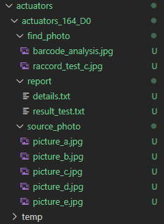
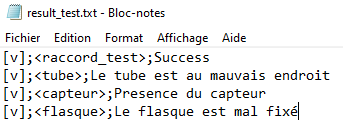

# Description détaillée
Dans cette partie, nous détaillerons que les points techniques difficiles à comprendre. Pour autres fonctions, relativement simples, il suffit de se reporter au code qui est commenté.

# Sommaire
[Introduction](intro.md)  
[**Description détaillée  (cette page)**](detailed_description.md)  
* [Classe _Control_]()
* [Classe _Test_]()  

[A faire](todo.md)

# Mécanismes généraux
### L'environment
Dans python, les chemins absolus sont définis par rapport à l'endroit où est appelé le fichier qui exécute la ligne. Ainsi,que l'on exécute `actuator_checker.py` depuis `ACS\` ou depuis `ACS\source` le chemin de base, appelé `source_path`, est défini en `ACS\`.  

# Classe _Control_
C'est la classe qui gère les contrôles. Elle réalise une multitude de tests. Elle gère aussi le système de fichiers qui est détaillé ci-dessous.

### Nom des dossiers

### Système de fichier
Un contrôle génère beaucoup de données, il faut les ranger correctement sinon il sera difficile d'accéder aux infos à postériori. Les infos des vérins contrôlés sont enregistrées dans le dossier `ACS\actuators`.  

Toutes les données d'un contrôle sont enregistrées dans un seul et même dossier. Il est nommé dans un style similaire à `actuators_164_D0`. `164` est seulement un incrément juste pour s'assurer que deux dossiers n'aient pas le même nom. Ainsi, si on test deux fois le même vérin, l'incrément sera différent. Il est donc différent d'un numéro unique associé à un vérin (type _MAC_).  `D0` réfère à la configuration attendue du vérin qui est déterminée par lecture du QR code. 

> Rappel : Les noms des configurations sont [personnalisables](intro.md#personaliser-une-configuration)

L'architecure-type est représentée ci-dessous.

On y retrouve les dossiers suivants :
- `source_photo` contient les 5 photos du vérin (nommées selon la convention introduite [ici](intro.md#détermination-de-la-configuration-à-vérifier))
- `find_photo` regroupe les photos des résultats. En effet, chaque test détecte un composant, l'entoure en rouge et enregistre l'image. Ainsi, on sait précisément ce que chaque test a détecté.  
- `report_photo` détient différents éléments nécessaires à la génération du rapport. On a donc les résultats de chaque test et le rapport.

### Le dossier `temp`
L'algorithme prend les photos puis détecte le QR code afin de déterminer la configuration souhaitée du vérin. On a donc un moment où l'on a les images, mais on n'a pas le nom du dossier. Elles sont donc temporairement stockées dans le dossier `ACS/actuators/temp`  

Si la méthode de détection des QR codes venait à ne pas être assez robuste, il faudrait réorganiser l'ordre des opérations. On prendrait les photos du vérin, on les place dans un dossier `actuator_<n° d'itération>` et _ensuite_ on réalise la lecture du QR code. Ainsi, en cas d'incapacité de détermination du QR code, les images seraient dans un dossier spécifique et non dans le dossier `temp` qui est effacé à chaque noouveau vérin testé.  

Cette nouvelle organisation permettrait de garder les traces de tous les vérins qui n'ont pas pu être analysés, ce qui est pratique quant on fait de l'amélioration continue.  

### Jugement
> Le jugement est l'action de déterminer si un vérin est bon ou mauvais.  

Chaque test renvoie une valeur booléenne `True` ou `False`. Il s'agit donc seulement de réaliser le produit booléen de tous les tests afin de déterminer le résultat global du contrôle.

Pour avoir plus de détail sur les résultats de chaque test en cas d'échec, vous pouvez vous reporter au fichier `actuator_XXX_D0/report/result_test.txt`. Il ressemble à ça l'image ci-dessous. Il est fait pour être lu par la machine et non par un humain.

# Classe _Test_
Cette classe réalise un test. Le point le plus technique est que l'on utilise la méthode qui est précisée dans le fichier de configuration `ACS/config/actuators_config.cfg`. Pour cela, on utilise la méthode python `getattr()`

> Notez que c'est cette astuce qui permet de pouvoir utiliser une méthode qui est précisée dans le fichier de configuration et donc que chaque test est personnalisable.