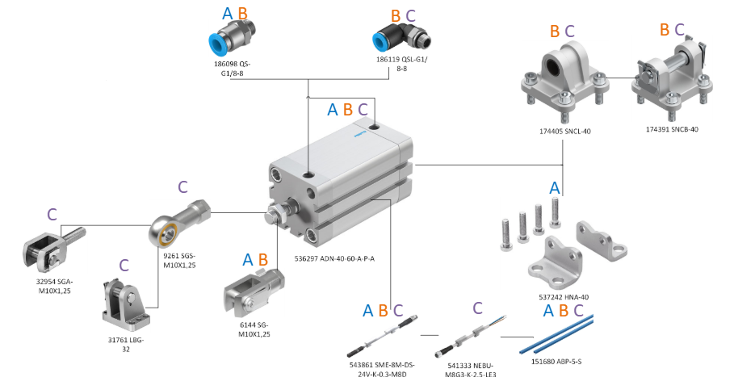
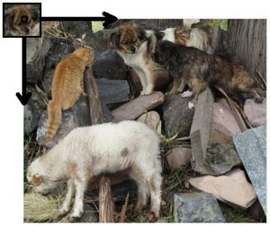
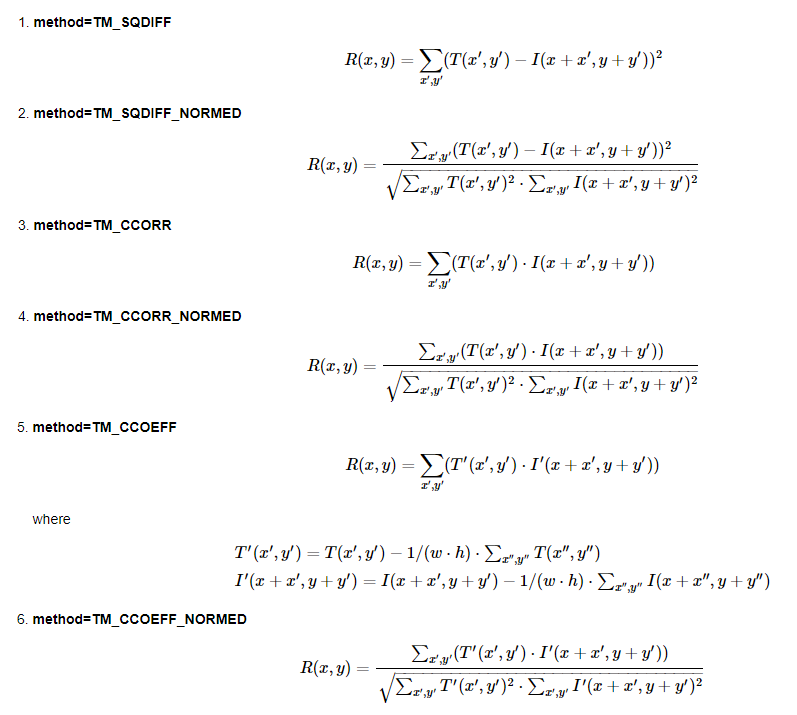
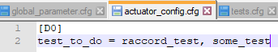
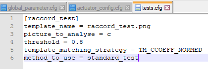

# ACS
# Introduction
ACS est l'acronyme de Automatic Control Station. Dans notre cas, il s'agit de vérifier des vérins **mais l'outil est bien plus performant que cela** (cf §Personalisation).  
Nous sommes sur une ligne qui produit des vérins variés. Etant donné la multitude de configurations possibles, nous vérifions que des composants sont présents sur le vérin.

Pour ce rendre compte de la grande diversité du système, voici une infime partie des composants installables 


# Sommaire
[**Introduction (cette page)**]()  
[Description détaillée]()  
* [Classe _Control_]()
* [Classe _Test_]()  

[A faire](todo.md)


# Fonctionnement
## Fonctionnement général
* L'algorithme vérifie si un vérin donné correspond bien à la configuration annoncée.  
* Chaque configuration contient une multitude de *test*  
* Chaque test vérifie une seule *caractéristique*
* Une caractéristique est associée à
  * une face
  * un composant à analyser

## Détermination de la configuration à vérifier
L'algorithme se base sur les 5 faces du vérin. Elles sont nommées comme suit:  


Sur la face E est lue un QR code. Celui-ci permet d'indiquer la configuration attendue et donc les caractéristiques que l'on va rechercher sur chaque face.  
:thought_balloon: A l'avenir il pourra s'agir d'un système RFID.

## Reconnaissance d'une caractéristique  
### La théorie
La reconnaissance de composant s'effectue via un algorithme de _template matching_. Cela consiste à rechercher une petite image (appelée  _template_), qui représente la caractéristique recherchée, dans une autre image (celle d'une face de vérin).  

Pour ce faire, pour chaque pixel de la grande image, un calcul matriciel est fait avec les pixels du _template_.
Comme le montre l'image ci-dessous (tirée de la documentation opencv).

  
Il existe une multitude de calcul matriciel différents pour réaliser cette opération


(image tirée de la documentation d'opencv)  
A la fin du calcul, on obtient un nombre entre 0 et 1 qui peut s'apparenter à une probabilité de présence. 1 signifiant que la position sélectionnée dispose d'exactement les mêmes pixels aux mêmes emplacement que ceux du _template_.  

### Justification de son utilisation
Dans notre cas, cet algorithme est fonctionne parfaitement car
on ne recherche pas le template avec une déformation (i.e. une rotation, une aggrandissement, un rétrécissement, ...) puisque le vérinn contrôlé est toujours dans la même position et la photo toujours prise de la même manière.

Nous aurions pu coder intégralememnt cet algorithme, mais nous sommes pas en TP donc nous nous contenterons d'utiliser les algorithmes implémentés dans la bibliothèque `opencv`. D'ailleurs, si vous souhaitez en apprendre plus sur cet algorithme, n'hésitez pas à jeter un oeil à la documentation de cette bibliothèque [ici :link: (8/05/20)](https://docs.opencv.org/3.4/de/da9/tutorial_template_matching.html)

Nous aurions pu nous pencher aussi sur un algorithme d'intelligence artificielle avec réseaux de neurones mais cela est bien plus compliqué à mettre en oeuvre surtout que dans notre situation le _template matching_ correspond très bien à notre demande.


# Personalisation
Dans cette documentation, nous avons pris l'exemple d'un vérin mais il peut s'agir de n'importe quel autre produit. Il suuffit simplement de paramétrer l'outil correctement. Tout est expliqué ci-dessous.
## Personaliser une configuration
Vous pouvez créer vos propres conficurations et donc choisir les composants qui doivent être testés. Pour cela, rendez-vous dans le fichier `ACS/config/actuator_config.cfg`
  

Les élements à déclarer sont
* Le nom de la configuration. Il s'agit en réalité plus d'une référence puisque c'est l'information qui est enregstrée à l'intérieur du QR code.
  > Un outil à été développé [ici :link:](../source/tools/Ecriture_QR_codepython.py) pour générer le QR code associé à une configuration

* La variable `test_to_do` suivi de tout les noms des tests que l'ont veut réaliser dans cette onfiguration. L'ajout de test est décrit au paragraphe suivant.


## Personaliser un test
Pour créer un test il faut le déclarer dans le fichier de configuration `ACS/config/tests.cfg` La déclaration d'un test se fait comme suit   
Analysons une par une la déclaration du test:  
1. `[raccord_test]` Il s'agit du nom du test.  
    :warning: Noter bien la présence des crochets `[`
2. ``template_name = raccord_test.png`` C'est le nom du template qui est donné à l'algorithme (cf §Fonctionnement). Il faut placer cette image dans le dossier `ACS/config/templates/raccord_test.png`
3. ``picture_to_analyse = c`` C'est la face sur laquelle on voit le composant que l'on étudie.  
    :warning: La lettre de la face est en minuscule
4. ``threshold = 0.8`` Il s'agit du seuil de l'algorithme de template matching. Entre 0 et 1.  
5. `template_matching_strategy = TM_CCOEFF_NORMED` C'est la méthode de détection utilisée (cf Explication de l'algorithme de détection).  
6. `method_to_use = standard_test` C'est la méthode de test utilisée.  
    :point_right: Vous pouvez créer vos propres tests pour avoir un comportement particulier (décrit dans le § suivant)


## Créer un template
Comme nous avons pu l'expliquer dans le paragraphe sur la théorie de la reconnaissance de caractéristique, l'algorithme de _template matching_ nécessite forcément un _template_. Il est d'ailleurs explicité lorsque l'on créé de noveaux tests (cf §juste u-dessus, ligne 2 ``template_name``). Nous allons donc revenir un peu pplus en détail dessus.  


Pour être robuste, le template doit être localisé. IL ne faut pas qu'il ait présence de "superflu" (par exemple l'arrière plan ). Il faut bien comprendre que l'image _template_ est utilisé pour un test et votre test ne doit pas dépendre si le fond change.
Il convient donc de choisir judicieusement la face associée au template.
Un exemple est présent ci-dessous.

  

  

> :rotating_light: Les deux _template_ sélectionnés ici paraissent pas très naturel mais c'est juste que l'on ne slectionne uniquement ce qui est essentiel et qui, pour l'algorithme, permet de reconnaître le composant.

> :pushpin: Ce n'est pas grave si le template ne représente pas l'intégralité du composant. Il doit juste représenter une partie qui est unique à ce composant et seulement à ce celui-ci comme vous pouvez le voir juste au-dessus :arrow_down_small:.

## Personaliser un test avancé (changement de la méthode de reconnaissance)
Le test standard permet seulement de déterminer la présence ou l'absence d'un composant. C'est déjà une fonctionnalité assez puissante mais qui reste cependant limité. Ainsi, si vous voulez par exemple vous assurez qu'en plus d'être présent le composant soit à droite, vous allez être amené à écrire vos propres tests.  

Il faut ajouter une méthode à la classe _Test_. :pencil2: Nommez la nouvelle méthode sous la forme *<nom_methode>_test*, cela permettra d'y voir plus clair dans votre code. Vous devriez obtenir une ligne comme ceci
```python
def <nouvelle_methode_de_reconnaissance>_test(self):
```
Il suffit ensuite de la déclarer dans le test: écrivez `method_to_use = <nouvelle_methode_de_reconnaissance>_test` dans le point 6. du paragraphe précédent.
