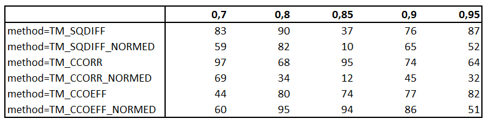
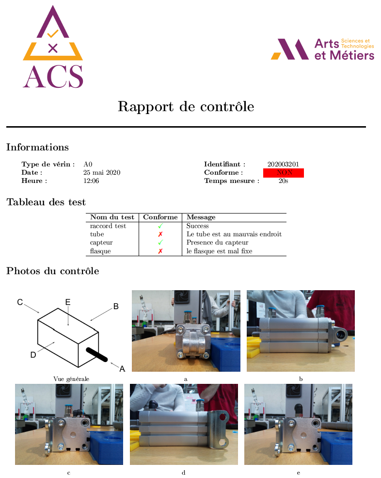

# A faire
Nous détaillons ici les améliorations qui sont à apporter au système. Des pistes d'implémentation sont explicitées afin de faciliter leur mise en place.

# Sommaire
[Introduction](intro.md)  
[Description détaillée](detailed_description.md)  
* [Classe _Control_]()
* [Classe _Test_]()  

[**A faire  (cette page)**](todo.md)

## Tests de robustesse
La reconnaissance d'image n'est pas une science exacte. Ainsi, lorsque l'on développe un système, il faut s'assurer que le système est robuste.
> On dit qu'un système est __robuste__ lorsqu'il fonctionne dans des conditions dégradées. 

Dans notre cas, ces conditions dégradées peuvent être provoquées par :

- Le fond. Nous n'avons pas un fond uni ce qui signifie que l'arrière-plan peut varier. Par exemple, il n'est pas souhaitable que si une personne se balade cela fausse le contrôle. Il faut donc vérifier la robustesse.

- La position. En effet, si les vérins ne sont pas positionnés tous au même endroit à chaque contrôle alors ils n'ont pas la même taille lorsque l'on prend une photo. C'est donc une nouvelle source de variabilité. Afin de contrer cet effet, nous avons préféré faire une mise en place isostatique du vérin. Les fichiers 3D ont été réalisés, mais n'ont pas pû être testé. Des ajustements sont sûrement à prévoir.

- Une conséquence directe de la position est le flou. En effet, l'appareil photo utilisé a une distance focale fixe. Ainsi, prendre une image floue peut arriver bien plus rapidement qu'on ne le pense. Or elle est plus difficile à analyser (comme pour un humain en somme). 
Ce problème est corrigé en programmant correctement la trajectoire du robot collaboratif.

- La luminosité. C'est la bête noire des algorithmes de reconnaissance d'image. C'est sûrement l'élément auquel il faut faire le plus attention. Nous discuterons ci-dessous la manière dont nous avions prévue de vérifier la robustesse face à ce paramètre.

Afin de réaliser, il faut d'abord récolter des données. Ainsi, il faut que tous les éléments soient en place (prise par le robot, algorithme de contrôle, positionnement isostatique). 
Il faut évidemment récolter ces données de la même manière qu'en fonctionnement.
> Il est important que la luminosité varie si l'on veut tester la robustesse contre la luminosité.

### Stratégie pour les résultats
Pour assurer la robustesse envers la luminosité et l'absence de fond uni, nous pouvons jouer sur 2 paramètres que sont :  
- La méthode de reconnaissance
- Le seuil d'acceptabilité.

> Notez que ces 2 paramètres sont décrits lorsque l'on [personnalise un test](intro.md#personaliser-un-test) 

Il serait judicieux de réaliser une matrice où les lignes représenteraient les différentes méthodes de détection, les colonnes représenteraient les différents seuils acceptables et où chaque case représenterait la proportion de contrôle correcte avec les deux paramètres
> Un contrôle est dit **bon** lorsque le vérin correspond à sa configuration attendue.

> Un contrôle est dit **correct** si l'algorithme détermine correctement les composants présents sur le vérin. :warning: Cela ne signifie pas que le vérin est bon.

Un exemple de tableau est représenté ci-dessous. Les valeurs sont inventées de toutes pièces et ne sont pas cohérentes entre elles.

Nous souffrons d'un cruel manque de photo pour compléter une analyse décrite ci-dessus.

## Préciser les tests
En fonction de ce qui est nécessaire, il se peut que l'on attende d'un test qu'il vérifie qu'un composant soit à droite ou à gauche ou bien même imaginer des tests un peu plus _exotiques_.
Nous n'avons pas pû développer cet axe puisque nous n'avions plus accès aux vérins.

> Pour rappel l'ajout de test est précisé [ici](intro.md#personaliser-un-test-avancé-changement-de-la-méthode-de-reconnaissance)

## Génération de rapport
Nous avions prévu la génération d'un rapport de contrôle à la fin de celui-ci. Par manque de temps, nous n'avons pas pu l'implémenter mais le plus gros a déjà été fait. Le script qui génère le rapport est disponible dans `ACS/source/modules/clean_report_generation.py`. Il génère le rapport ci-dessous.

On peut aussi améliorer ce script en insérant les photos résultants de chaque test (chaque test produit une image avec le composant qu'il a détecté encadré en rouge). Ainsi, dans le rapport, on pourrait comprendre un peu plus ce qui a été détecté à chaque test.

> Vous aurez seulement à comprendre comment le script actuel fonctionne afin de l'ajouter dans le fichier `actuator_checker.py`